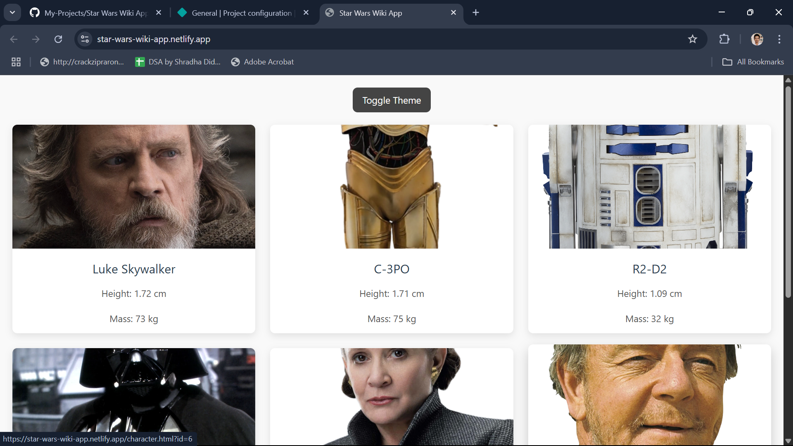
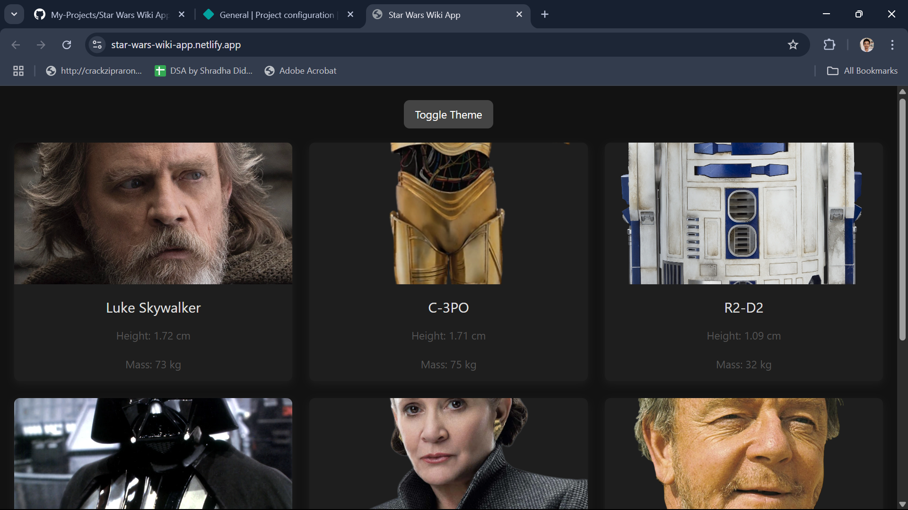
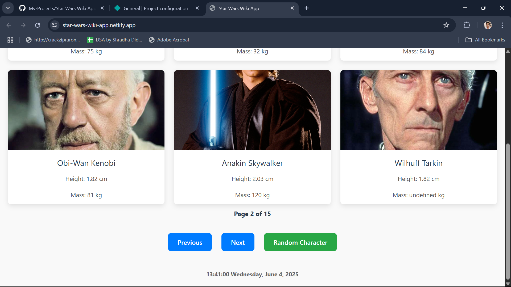
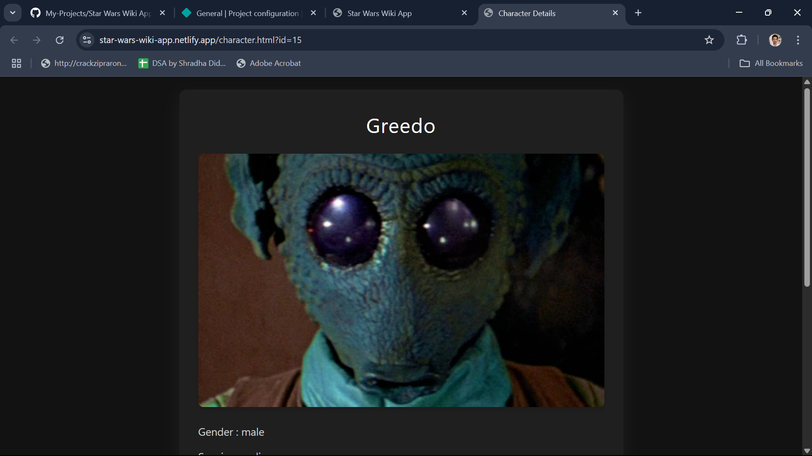
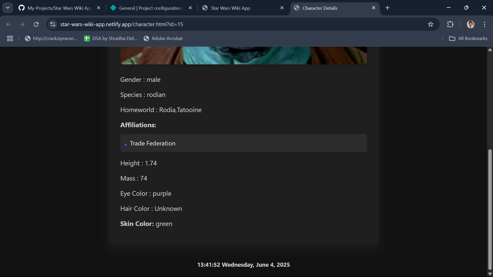

# Star Wars Wiki Application

## 📖 Project Overview
The Star Wars Wiki Application is a web-based encyclopedia that displays character data from the [Star Wars API](https://akabab.github.io/starwars-api/). It features a character gallery with pagination and individual character detail pages.

---

## ✅ Features

### 🌌 Main Page (Character Gallery)
- Displays characters in a 3×2 grid (6 per page)
- Fetches data from:  
    `https://akabab.github.io/starwars-api/api/all.json`
- Each character card shows:
    - Image
    - Name
    - Species
    - Gender
- Pagination with Next/Previous buttons
- Clickable cards open detailed character view in a new tab
- Live-updating footer clock (format: `HH:MM:SS Day Date`)

### 🧑‍🚀 Character Detail Page
- Opens in a new tab on card click
- Fetches data from:  
    `https://akabab.github.io/starwars-api/api/id/{id}.json`
- Displays:
    - Full-size image
    - Name, Gender, Species, Homeworld
    - Affiliation(s)
    - Height, Mass
    - Eye color, Hair color, Skin color
- Includes the same live-updating footer clock

---

## 🌐 API Information

- **Base URL:**  
    `https://akabab.github.io/starwars-api/api/`
- **All Characters Endpoint:**  
    `all.json`
- **Individual Character Endpoint:**  
    `id/{id}.json`
- **Sample Character Object Includes:**  
    `id`, `name`, `image`, `gender`, `species`, `homeworld`, `affiliations`, `height`, `mass`, `eyeColor`, `hairColor`, `skinColor`

---

## 🌟 Additional Features (Optional)
- Dark/Light Theme Toggle
- "Random Character" button to open a random detail page

---

## 🚀 Setup Instructions

1. Clone the repository:
     ```bash
     git clone https://github.com/your-username/star-wars-wiki-app.git
     cd star-wars-wiki-app
     ```
2. Open index.html file on any brower.

---

## 📸 Screenshots







---

## 🛠️ Challenges Faced

- **API Data Structure:** Adjusted components to handle missing or inconsistent fields in the API.
- **Pagination Logic:** Implemented robust pagination to handle edge cases.
- **Live Clock:** Used JavaScript intervals for real-time clock updates in both main and detail pages.

---

## 🌍 Deployment

- **Deployed Application:** ["https://star-wars-wiki-app.netlify.app/"]


---

## 📄 License

This project is for educational purposes only and uses the public Star Wars API.
