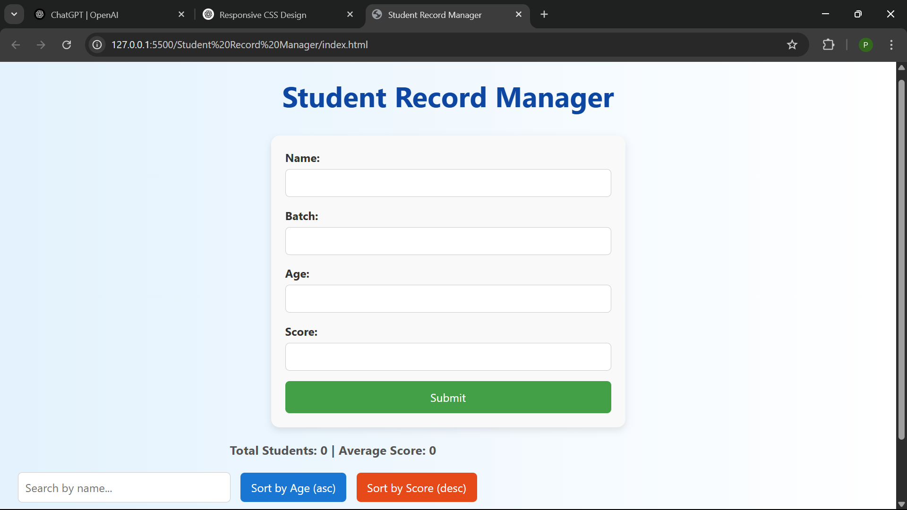
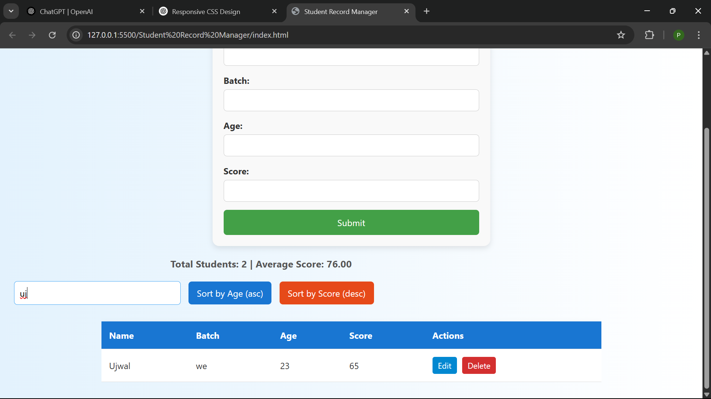

# Student Record Manager

A simple web app to manage student records using only HTML, CSS, and JavaScript (DOM manipulation).

## Features

- **Add Student:** Fill out a form to add a new student (Name, Batch, Age, Score).
- **View Records:** All students are displayed in a table.
- **Edit/Delete:** Edit or delete any student record directly from the table.
- **Search:** Live, case-insensitive search by student name.
- **Sort:** Sort students by Age (ascending) or Score (descending).
- **Bonus:** Shows total students, average score, and highlights students with score > 80.

---

## Demo

[Live Demo](https://flourishing-chebakia-3cfca3.netlify.app/) 

---

## Screenshots




---

## Usage

1. **Clone the repository:**
    ```bash
    git clone https://github.com/Ujwal1256/My-Projects.git

    ```

2. **Open Student Record Manager Folder**
3. **Open `index.html` in your browser.**

---

## How It Works

### 1. Add Student
- Fill in the form (Name, Batch, Age, Score).
- Click **Submit**.
- Input validation ensures all fields are filled, age is a number, and score is between 0–100.

### 2. View, Edit, Delete
- All students appear in a table.
- **Edit:** Click "Edit" to populate the form and update the record.
- **Delete:** Click "Delete" to remove the student.

### 3. Search
- Type in the search box to filter students by name (live, case-insensitive).

### 4. Sort
- Click **Sort by Age** or **Sort by Score** to reorder the table.

### 5. Bonus
- Displays total number of students and average score.
- Students with score > 80 are highlighted in green.

---

## File Structure

```
student-record-manager/
│
├── index.html
├── style.css
├── script.js
└── readMe.md
```

---

## Deployment

- [Netlify](https://netlify.com/).


